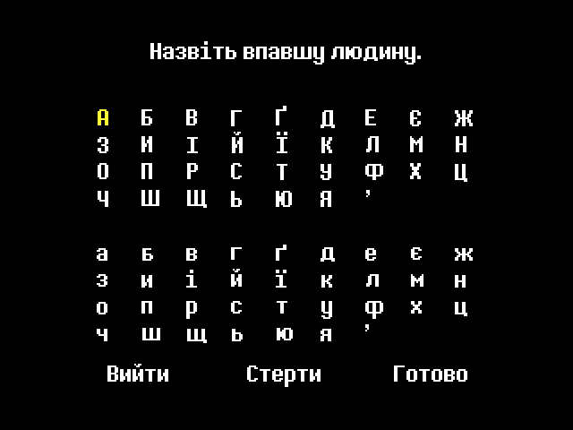
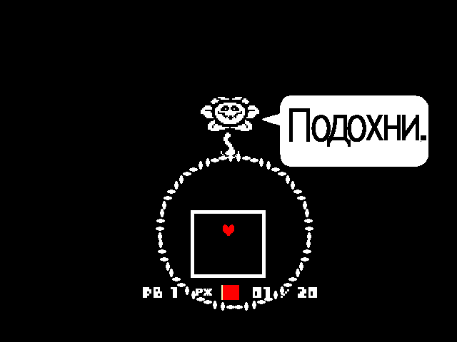
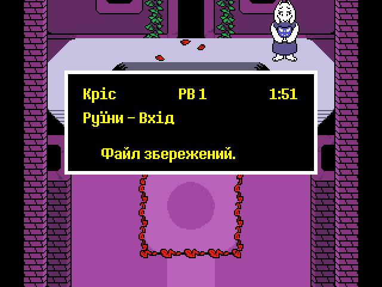
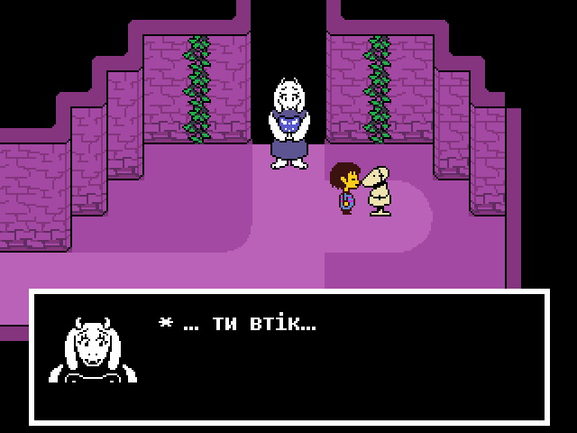

# undertale_ua
Переклад Undertale українською.

    
Приклади перекладу:

    
    
    
    
    
    
    

## Прогрес перекладу

Переклад тільки розпочато, тому зараз готово лише 10%
 
Якщо ви знайдете якісь помили, обов'язково опишіть їх у вкладці <a href="https://github.com/Roavello/undertale_ua/issues">"Issues"</a>

## Як встановити переклад?

Все дуже просто.
 
* I. Завантажуємо останню версію мода.

* II. Перейдіть до "Кореню" гри.

* III. Виделіть папку "lang" та файл "data.win", і перенесіть їх до теки гри. <b>ОБОВ'ЯЗКОВО ПОГОДЖУЄМОСЯ ІЗ ЗАМІНОЮ!</b>

* IV. Запускайте гру, та в налаштуваннях обираємо українську.

* V. Гарної гри!

# Attribution 4.0 International

 This work is licensed under a <a rel="license" href="http://creativecommons.org/licenses/by/4.0/">Creative Commons Attribution 4.0 International License</a>.