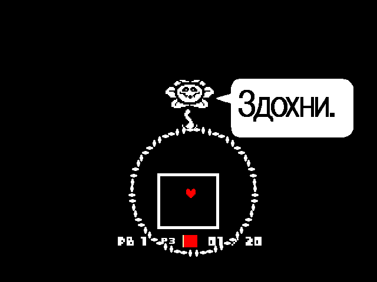
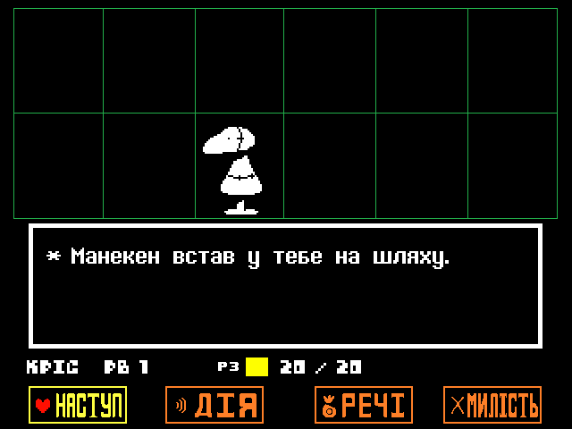
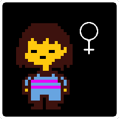
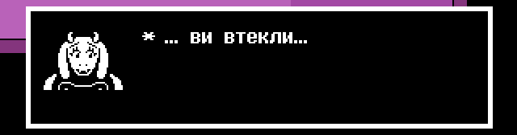
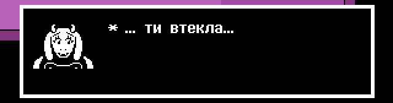
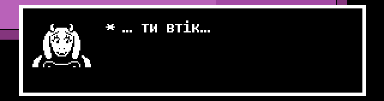
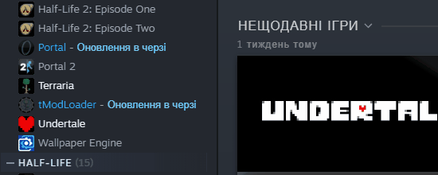
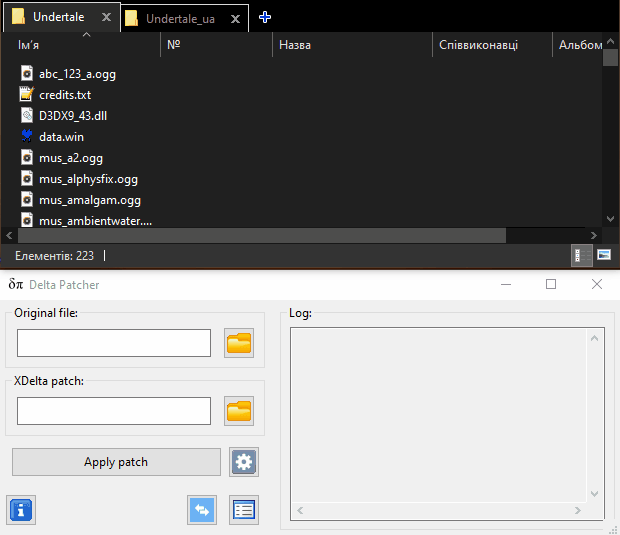
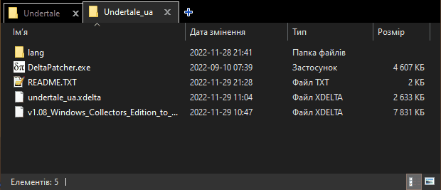

<h1>Новий українізатор для гри Undertale! (Ще в розробці.)</h1>
Ця модифікація, як не дивно, додасть солов'їну мову та багато інших цікавих речей, які вам точно сподобаються.(Не плутати з перекладом Undertale на толоці.)
 

 

    
Приклади перекладу:

    
    
    
    
    
    
    
    
    

<h1>Особливості перекладу</h1>

Завжди хотіли задоґнатити купу віртуальних грошей богоподібному Тобі Фоксу, або відгамселити Скажену Нявкалку всередені височенній раковині Папіруса, але у вас є лише комп'ютер? Нині ваш шанс <del>стати ВЕЛИКИМ ЦАБЕ</del> здійснити свою мрію, ще й українською!

<h2></h2>

<h3>Рамки</h3>

Завдяки цьому ігровий досвід на екрані роздільністю 16:9 буде набагато приємнішим!
 
 
Оберіть рамки, які вам більш до вподоби:
 
• Динамічні — такі рамки підлаштовуються під локацію, у якій ви перебуваєте.
 
• Статичні — звичайні рамки з гарним візерунком, які будь супроводжувати вас протягом всього проходження.
 
• Мінімалістичні — як зрозуміло з назви, нічого зайвого.

    
А чого я вам зуби заговорюю? Краще один раз побачичи, ніж сто разів почути!

    

<h2 CLEAR="left"></h2>

<h3>Собача святиня</h3>
Найсвятіше, найкрасивіше та найкорисніше місце у всій грі.
 
Віддавайте всі свої накопичення на розвиток святині та станьте повноцінними послідовниками собачої віри!
І пам'ятайте: Набридливий пес піклується про вас!(Очевидна брехня)

  
<h2></h2>

<h3>Скажена Нявкалка</h3>
Новий, секретний мінібосс із популярного у підземеллі аніме «Няв-Няв: Цьомка-Няшка» тепер на вашому комп'ютері!
 
Хай щастить.

  
<h2></h2>

<h2></h2>
 

<h3>Body Swap</h3>
Хитра річ, натхненна грою Shovel Knight на Ps Vita, яка дозволить вам краще асоціювати себе з головним героєм. Хочете грати за дівчинку або хлопчика? Грайте на здоров'я! Хочете залишити головного героя без статі? Будь ласка!
 
 
 
 

    
Занурьтесь у світ Undertale'у по максимуму!

    
    
    

  
<h2></h2>

<h3>Жодного Google Translate</h3>
Їй-богу, у тупу використовувати гугл перекладач якось взагалі не папайрусно.
 
Тому оревуар, дурнуватий перекладач, ми тебе ніколи більше не згадаємо! 
 

<h2></h2>

<h1>Куточок запитань(ЧаПи)</h1>

<h3>П: Для якої версії гри цей переклад?</h3>

В: Undertale 1.08
    
<h3>П: Скільки вже встигли перекласти?</h3>

В: _Ігровий текст_ - 25%
 
    _Озвучення_ - 30%
 
    _Полірування_ - 0%
 
    =====================
 
    Роботи попререду ще багато.
 
    Якщо знайдете якісь помилки, обов'язково опишіть їх у вкладці <a href="https://github.com/Roavello/undertale_ua/issues">"Issues"</a>

<h3>П: Скільки людей працює над перекладом?</h3>
В: <a href="https://github.com/Roavello">Roavello</a> - Головний перекладач, бариста. 
    <a href="https://github.com/marklangerhacker">Mark L.</a> - Редактор, та допомога з портом перекладу на MacOS. 

<h3>П: Як встановити переклад?</h3>

В: Все дуже просто.
 
* I. Завантажуємо останню версію мода та розархівовуємо в зручне для вас місце.

* II. Переходимо до «Кореню» гри.

* III. Запускаємо DeltaPatcher з архіву.

* IIIa. У поле «Original file» переносимо оригінальний «data.win» файл.

* IIIb. У поле «XDelta patch» переносимо «UndertaleUa.xdelta» файл. (Примітка: якщо ви купили гру не в Steam, а в Магазині Windows, або в GOG, то спочатку застосуйте патч «v1.08_Windows_Collectors_Edition_to_Steam.xdelta», і після поверніться до початку кроку IIIb.)

* IIIc. Тиснемо «Apply patch» та чекаємо завершення

* IV. Виделіть папку «lang», файли «mus_mewmew.ogg», «mus_sfx_dogseal.ogg» та перенесіть їх до теки гри.

* V. Запускайте гру та в налаштуваннях обираємо українську.

* VI. Гарної гри!

<h2></h2>

<h1>Attribution 4.0 International</h1>

 
This work is licensed under a <a rel="license" href="http://creativecommons.org/licenses/by/4.0/">Creative Commons Attribution 4.0 International License</a>.