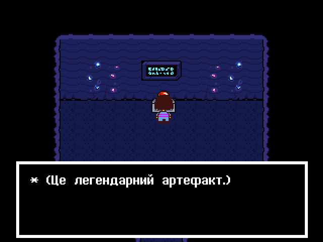
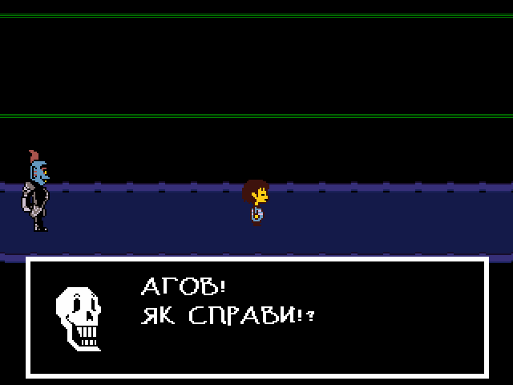
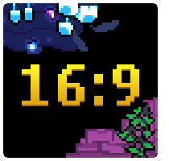

# Новий українізатор для гри Undertale!
Ця модифікація, як не дивно, додасть солов'їну мову та багато інших цікавих речей, які вам точно сподобаються.

(Не плутати з перекладом Undertale на толоці.)

    
Приклади перекладу:

    
    
    
    
    
    
    
        
    
    
    
    
    

# Особливості перекладу
")

Завжди хотіли пожертвувати купу віртуальних грошей богоподібному Тобі Фоксу, або відгамселити Скажену Нявкалку всередині височенної раковини Папайруса, але у вас є лише комп'ютер і смартфон? Нині ваш шанс здійснити свою мрію, ще й українською!
 
<h3></h3>

<h3>Рамки</h3>
Завдяки ним ігровий досвід на екрані роздільністю 16:9 буде набагато приємнішим!
Обирайте, які вам до вподоби:
 
• Динамічні — такі рамки підлаштовуються під локацію, в якій ви перебуваєте.
 
• Статичні — звичайні рамки з гарним візерунком, які будуть супроводжувати вас протягом всього проходження.
 
• Мінімалістичні — як зрозуміло з назви, нічого зайвого.

    
А чого вам зуби заговорювати? Краще один раз побачити, ніж сто разів почути!

    

<h3 CLEAR="left"></h3>

<h3>Повідомлення про від'єднаний контролер</h3>
Якщо під час гри ваш ґеймпад розрядився, або ви його від'єднали, гра автоматично стає на павзу та пише щось цікавеньке!
 
(Ця особливість за замовчуванням вимкнена)
  
<h3></h3>

<h3>Собача святиня</h3>
Найсвятіше, найкрасивіше та найкорисніше місце у всій грі.
 
Віддавайте всі свої накопичення на розвиток святині та станьте повноцінними послідовниками собачої віри!
І пам'ятайте: Надокучливий собака піклується про вас! (Очевидна брехня)
  
<h3></h3>

<h3>Скажена Няв-Няв</h3>
Новий секретний мінібос із популярного у підземеллі аніме “Няв-Няв: Цьомка-Няшка” тепер на вашому пристрої!
 
Хай щастить.
  
<h3></h3>

<h3>Собаче Казино</h3>
Стривайте, це що... Азартна залежність у моїй грі для всієї сім'ї?
 
ЩЕ Б ПАК!
 
Виграйте унікальні винагороди для справжніх ҐЕЙМЕРІВ або програйте всі свої накопичення слот-машині чи, можливо, Сансу в покер.

  

---

### Жодного Google Translate
Їй-богу, перекладати таку гру *гугл перекладачем* якось взагалі не папайрусно.
 
Тому кажемо оревуар дурнуватому перекладачу і більше ніколи про нього не згадуємо!

### Більший розмір вікна гри
Гра більше не буде мікроскопічною, адже розмір її вікна буде автоматично підлаштовуватися під розмір вашого екрана!

### Підтримка контролерів
Локалізація буде доступна не лише на Windows, а ще й на Linux, Mac, Android та PsVita!

### Захисник зап'ястя
Особливість із DELTARUNE, що дозволяє миттю пропускати текст, затиснувши кнопку [ігрового меню].
Корисна для ваших перепроходжень або спідранів!

### Примусова поява Перепрошую
Можливість миттєво натрапити на цього ворога в Жаркраї без очікувань на певну дату та час.

### Коментарі Меттатона
Під час свого мюзиклу Меттатон коротко коментує танок головного героя.

### Нагороди з консолей
Виконуйте цікаві завдання та отримуйте за це призи (вони ж “досягнення”)!
P.S. Повноцінно вони працюють лише на Android (Досягнення в Google Play) та Vita.
У локалізації на інших ОС -- суто косметичні й ніяк не впливають на ваш профіль у клієнтах ігрових сервісів.

# Новини та оголошення
#### 25 червня 2025
**Українська локалізація UNDERTALE - Реліз (v1.0)**

**Що нового:**
* Повний переклад повноцінної версії гри **UNDERTALE!!!**
* Переклад працює на **Windows, Linux, Maс, Android і PS Vita!!**
* Консольні ексклюзиви!
* Додаткові параметри!
* LITE версія.

Детальніше про них, різницю в локалізації між різними ОС, а також відповіді на ЧаПи читайте в нещодавньому [довгочиті ПОСТУПУ](https://pereclaw.nekoweb.org/postupy/summer25/).
(Для найкращого відображення сторінки радимо переглядати її з ПК або у вебверсії “для комп'ютера”)
<h4>
— Pereclaw<h4>

# Автори
### Над українською локалізацією працювала спілка “Pereclaw”

<h3></h3>

Усі, хто працювали над перекладом:

<h3>Організатор</h3>
<ol>
    <li type="disc"><a href="https://github.com/Roavello">Andrew "Roavello" Camomile</a> 
</ol>
<h3>Перекладачі</h3>
<ol>
    <li type="disc"><a href="https://github.com/Roavello">Andrew "Roavello" Camomile</a> 
    <li type="disc"><a href="https://github.com/DanielleTlumach">DanielleTlumach</a> 
    <li type="disc"><a href="https://github.com/yanchukcha">yanchukcha</a> 
    <li type="disc"><a href="https://discord.com/users/1004070402840084590">x1ki_</a> 
    <li type="disc"><a href="https://discord.com/users/246731296435470337">Sandwick</a> 
    <li type="disc"><a href="https://discord.com/users/509078768288137236">Chiromy</a> 
    <li type="disc"><a href="https://discord.com/users/493110908424421377">BoneKiller</a> 
    <li type="disc"><a href="https://discord.com/users/529280743705149452">pita_guy</a> 
</ol>
<h3>Редактори</h3>
<ol>
    <li type="disc"><a href="https://discord.com/users/1003288266587521094">Chlorine</a> 
    <li type="disc"><a href="https://github.com/DanielleTlumach">DanielleTlumach</a> 
    <li type="disc"><a href="https://github.com/yanchukcha">yanchukcha</a> 
    <li type="disc"><a href="https://discord.com/users/529280743705149452">pita_guy</a> 
    <li type="disc"><a href="https://discord.com/users/341277267567181835">silly_garlic</a> 
    <li type="disc"><a href="https://discord.com/users/565975326451171363">shultz42</a> 
    <li type="disc"><a href="https://discord.com/users/458535829753561099">perishrad</a> 
</ol>
<h3>Озвучення</h3>
<ol>
    <li type="disc">Квітик - <a href="https://discord.com/users/565975326451171363">pita_guy</a> 
</ol>
<h3>Особлива подяка</h3>
<ol>
    <li type="disc">Наші улюблені тестери 
    <li type="disc"><a href="https://github.com/marklangerhacker">Mark L.</a> 
    <li type="disc"><a href="https://github.com/ytrav">Maeve</a> 
    <li type="disc"><a href="https://discord.com/users/569481225148956672">foalex</a> 
    <li type="disc"><a href="https://x.com/skolomyikosh">Мигаль Кушницькый</a> 
    <li type="disc"><a href="https://github.com/danielah05/UndertaleDecomp">Vultumast та Daniela за Undertale Decompilation</a> 
    <li type="disc"><a href="https://gamejolt.com/games/undertale-android/726064">Booker Dev за Мобільний порт Undertale
</a> 
</ol>

 

# Куточок запитань(ЧаПи)

### П: Для якої версії гри цей переклад?
В: Undertale 1.08
    
### П: Як завантажити переклад?
В: Там же, де й перекладене UNDERTALE DEMO -- у [Releases](https://github.com/Roavello/undertale_ua/releases) на [KULI](https://kuli.com.ua/undertale#translations), або [Nexusmods](https://www.nexusmods.com/undertale/mods/12?tab=files)

### П: Коли вийде переклад?
В: 27 червня 2025!

### П: Із якої мови робимо переклад?
В: Із мови оригіналу, себто англійської, з оглядом на офіційну японську локалізацію.

### У яких крамницях можна придбати гру, щоб на неї ставилась локалізація?
В: Локалізація сумісна з копіями гри, придбаними в [Steam](https://store.steampowered.com/app/391540/Undertale/), [GOG](https://www.gog.com/en/game/undertale) або [Крамниці Microsoft](https://www.xbox.com/en-us/games/store/undertale-pc/9n046hwgq4j2)

### У мене пройдена демоверсія гри з вашим перекладом. Чи підтягне мій прогрес з неї повна версія гри, як це робить DELTARUNE?
В: На жаль, ні. Зі слів Тобі Фокса, DEMO він створював на старезному ПЗ із зовсім іншими спроможностями.

### Чи зробите ви локалізацію гри на інші ОС? Наприклад, Nintendo Switch або PlayStation 4?
В: Ні, оскільки для цього перекладачам, а потім і гравцям довелося б зламувати свої приставки, що є порушенням їхньої “Угоди користувача” або “Умов обслуговування”.

### П: Чому ж тоді ви зробили переклад гри на PlayStation Vita?
В: Тому що ця приставка, на відміну від тих двох, офіційно більше не підтримується й не обслуговується. Також на Vita вже неможливо легально придбати ні цифрову копію гри, ні її фізичне видання.

### П: Чи зможу я отримувати колекційні картки гри в Steam, поставивши цю локалізацію?
В: Так, зможете. Наша локалізація не впливає на взаємодію гри із клієнтом Steam.

### П: Куди краще звертатися, якщо під час гри з перекладом мені трапиться баґ або текстова помилка?
В: Хоча абсолютну більшість різних помилок і баґів ми виправили ще на етапі Вичитки й Тестування, якщо знайдете якісь — просимо повідомляти про них на нашому Discord-сервері DR/UT Україна, або принаймні в коментарях до цього посібника.
У крайньому разі можете відправити листа на імейл undertale.ukrloc.pereclaw@gmail.com.

## UNDERTALE DEMO

### П: У DEMO працюють контролери?
В: Ні, однак під нього можна налаштувати введення свого контролера у Steam, попередньо додавши застосунок демоверсії у свою бібліотеку ігор, або ж завантажити та налаштувати програму JoyToKey.

<h2></h2>

### Attribution 4.0 International

 
This work is licensed under a <a rel="license" href="http://creativecommons.org/licenses/by/4.0/">Creative Commons Attribution 4.0 International License</a>.