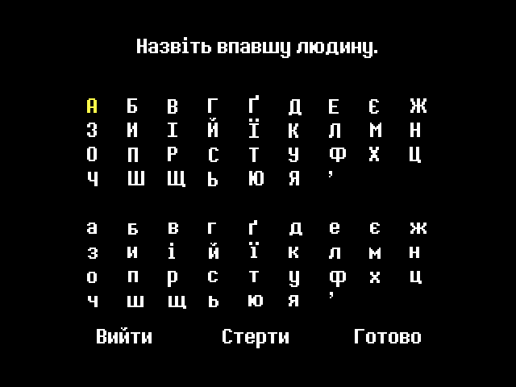
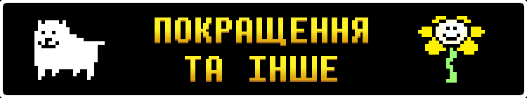

# Новий українізатор для гри Undertale! (Ще в розробці.)
Ця модифікація, як не дивно, додасть солов'їну мову та багато інших цікавих речей, які вам точно сподобаються.

(Не плутати з перекладом Undertale на толоці.)

    
Приклади перекладу:

    
    
    
    
    
    
    
        
    
    
    
    
    

# Особливості перекладу
")

Завжди хотіли пожертвувати купу віртуальних грошей богоподібному Тобі Фоксу, або відгамселити скажену Нявкалку всередині височенної раковини Папайруса, але у вас є лише комп'ютер? Нині ваш шанс здійснити свою мрію, ще й українською!
 
<h3></h3>

<h3>Рамки</h3>
Завдяки цьому ігровий досвід на екрані роздільністю 16:9 буде набагато приємнішим!
Оберіть рамки, які вам більш до вподоби:
 
• Динамічні — такі рамки підлаштовуються під локацію у якій ви перебуваєте.
 
• Статичні — звичайні рамки з гарним візерунком, які будуть супроводжувати вас протягом всього проходження.
 
• Мінімалістичні — як зрозуміло з назви, нічого зайвого.

    
А чого я вам зуби заговорюю? Краще один раз побачити, ніж сто разів почути!

    

<h3 CLEAR="left"></h3>

<h3>Повідомлення про від'єднаний ґеймпад</h3>
Якщо під час гри ваш ґеймпад розрядиться, або ж ви ненавмисно його від'єднаєте, якщо у вас він провідний, Undertale автоматично стане на паузу і напише щось цікавеньке!
 
(Ця особливість за замовчуванням вимкнена)
  
<h3></h3>

<h3>Собача святиня</h3>
Найсвятіше, найкрасивіше та найкорисніше місце у всій грі.
 
Віддавайте всі свої накопичення на розвиток святині та станьте повноцінними послідовниками собачої віри!
І пам'ятайте: Набридливий пес піклується про вас! (Очевидна брехня)
  
<h3></h3>

<h3>Скажена Няв-Няв</h3>
Новий секретний мінібос із популярного у підземеллі аніме «Няв-Няв: Цьомка-Няшка» тепер на вашому комп'ютері!
 
Хай щастить.
  
<h3></h3>

<h3>Собаче Казино</h3>
Стривайте, це що... Азартна залежність у моїй грі для всієї сім'ї?
 
ЩЕ Б ПАК!
 
Виграйте унікальні призи для справжніх ГЕЙМЕРІВ, або програйте всі свої накопичення слот-машині, чи, можливо, Сансу в покер?

  

---

### Жодного Google Translate

Їй-богу, перекладати таку гру *гугл перекладачем* якось взагалі не папайрусно.
 
Тому кажемо оревуар дурнуватому перекладачу і більше ніколи про нього не згадуємо!

### Більший розмір вікна гри

Гра більше не буде мікроскопічною адже розмір її вікна автоматично буде підлаштовуватися під розмір вашого екрану!

### Різні платформи

Локалізація буде доступна не лише на Windows, а ще й на Linux, Mac, Android та PsVita!

### Декомпіляція

Завдяки [Vultumast та Daniela](https://github.com/danielah05/UndertaleDecomp) зі світової спільноти Undertale та Deltarune, які розпакували гру у файл проєкту її рушія, ми маємо змогу з легкістю перенести переклад з усіма ексклюзивами консолей на всі ПК платформи! Також, автори декомпіляції додали власних покращень до гри, такі як:
- Швидкий пропуск тексту з Deltarune
- Налаштування гучності гри
- Відновлені стерео ефекти з найперших версій гри
- Та багато чого іншого

# Новини та оголошення
#### 22 Квітня 2025
Укртейл завтра? Так!
 
Ну, гаразд, майже. Наш переклад готовий, як і редакція. 
Але швидко вичитати гору тексту та знайти у ній помилки у написанні слів та пунктуації ми самостійно не зможемо. 
Тому ми запрошуємо ТЕБЕ, читачу, доєднатися до нашої команди тестерів за посиланнями: 
Сервер Діскорд: https://discord.gg/FZC2CSDg (анкета вбудована!) 
Google Форми: https://forms.gle/8pEoXRQeJkA7p2Mx6 
Набір триватиме до 26-ГО КВІТНЯ ВКЛЮЧНО, тож не зволікайте! 
<h4>
— Andrew "Roavello" Camomile<h4>

# Автори
### Над українською локалізацією працювала спілка “Pereclaw”

<h3></h3>

Усі, хто працює над перекладом:

<h3>Організатор</h3>
<ol>
    <li type="disc"><a href="https://github.com/Roavello">Andrew "Roavello" Camomile</a> 
</ol>
<h3>Перекладачі</h3>
<ol>
    <li type="disc"><a href="https://github.com/Roavello">Andrew "Roavello" Camomile</a> 
    <li type="disc"><a href="https://github.com/DanielleTlumach">DanielleTlumach</a> 
    <li type="disc"><a href="https://github.com/yanchukcha">yanchukcha</a> 
    <li type="disc"><a href="https://discord.com/users/1004070402840084590">x1ki_</a> 
    <li type="disc"><a href="https://discord.com/users/246731296435470337">Sandwick</a> 
    <li type="disc"><a href="https://discord.com/users/509078768288137236">Chiromy</a> 
    <li type="disc"><a href="https://discord.com/users/493110908424421377">BoneKiller</a> 
    <li type="disc"><a href="https://discord.com/users/529280743705149452">pita_guy</a> 
</ol>
<h3>Редактори</h3>
<ol>
    <li type="disc"><a href="https://discord.com/users/1003288266587521094">Chlorine</a> 
    <li type="disc"><a href="https://github.com/DanielleTlumach">DanielleTlumach</a> 
    <li type="disc"><a href="https://github.com/yanchukcha">yanchukcha</a> 
    <li type="disc"><a href="https://discord.com/users/529280743705149452">pita_guy</a> 
    <li type="disc"><a href="https://discord.com/users/341277267567181835">silly_garlic</a> 
    <li type="disc"><a href="https://discord.com/users/565975326451171363">shultz42</a> 
</ol>
<h3>Озвучення</h3>
<ol>
    <li type="disc">Квітик - <a href="https://discord.com/users/565975326451171363">pita_guy</a> 
    <li type="disc">Меттатон - (Спойлери) 
</ol>
<h3>Особлива подяка</h3>
<ol>
    <li type="disc"><a href="https://github.com/marklangerhacker">Mark L.</a> 
    <li type="disc"><a href="https://github.com/ytrav">Maeve</a> 
    <li type="disc"><a href="https://discord.com/users/569481225148956672">foalex</a> 
    <li type="disc"><a href="https://x.com/skolomyikosh">Мигаль Кушницькый</a> 
</ol>

 

# Куточок запитань(ЧаПи)

### П: Для якої версії гри цей переклад?

В: Undertale 1.08
    
### П: Як завантажити переклад?

В: Ніяк. Хоч гра повністю перекладена, вона потребує виправленя всіх помилок, однак є ДЕМО, яку вже можна завантажити.

### П: Скільки вже встигли перекласти?

В: _Ігровий текст_ - 100%
 
    _Текстури_ - 100%.
 
    _Озвучення_ - Лишається відполірувати записи.
 
    _Редактура_ - 90%
 
    =====================
 
    Робота потроху кипить.
 

### П: Із якої мови робимо переклад?

В: Із мови оригіналу, себто англійської, з оглядом на офіційну японську локалізацію.

### У ДЕМО працюють контролери?

В: Ні, однак під нього можна налаштувати введення свого контролера у Steam, попередньо додавши застосунок демоверсії у свою бібліотеку ігор, або ж завантажити та налаштувати програму JoyToKey.

### П: Коли вийде переклад?

В: Скоро.

<h2></h2>

### Attribution 4.0 International

 
This work is licensed under a <a rel="license" href="http://creativecommons.org/licenses/by/4.0/">Creative Commons Attribution 4.0 International License</a>.