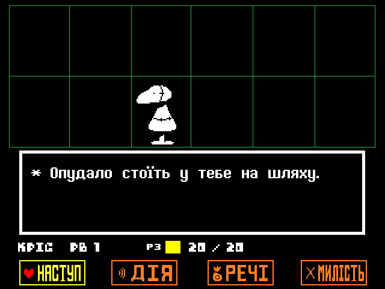

<h1>Новий українізатор для гри Undertale! (Ще в розробці.)</h1>
Ця модифікація, як не дивно, додасть солов'їну мову та багато інших цікавих речей, які вам точно сподобаються. (Не плутати з перекладом Undertale на толоці.)
 

 

    
Приклади перекладу:

    
    
    
    
    
    
    
        
    
    
    
    

<h1>Особливості перекладу</h1>

Завжди хотіли пожертвувати купу віртуальних грошей богоподібному Тобі Фоксу, або відгамселити скажену Нявкалку всередині височенної раковини Папайруса, але у вас є лише комп'ютер? Нині ваш шанс здійснити свою мрію, ще й українською!

<h2></h2>

<h3>Рамки</h3>

Завдяки цьому ігровий досвід на екрані роздільністю 16:9 буде набагато приємнішим!
 
 
Оберіть рамки, які вам більш до вподоби:
 
• Динамічні — такі рамки підлаштовуються під локацію у якій ви перебуваєте.
 
• Статичні — звичайні рамки з гарним візерунком, які будуть супроводжувати вас протягом всього проходження.
 
• Мінімалістичні — як зрозуміло з назви, нічого зайвого.

    
А чого я вам зуби заговорюю? Краще один раз побачити, ніж сто разів почути!

    

<h2 CLEAR="left"></h2>

<h3>Собача святиня</h3>
Найсвятіше, найкрасивіше та найкорисніше місце у всій грі.
 
Віддавайте всі свої накопичення на розвиток святині та станьте повноцінними послідовниками собачої віри!
І пам'ятайте: Набридливий пес піклується про вас!(Очевидна брехня)

  
<h2></h2>

<h3>Скажена Няв-Няв</h3>
Новий секретний мінібос із популярного у підземеллі аніме «Няв-Няв: Цьомка-Няшка» тепер на вашому комп'ютері!
 
Хай щастить.

  
<h2></h2>

<h2></h2>

  

<h3>Жодного Google Translate</h3>
Їй-богу, у тупу використовувати гугл перекладач якось взагалі не папайрусно.
 
Тому кажемо оревуар дурнуватому перекладачу і більше ніколи про нього не згадуємо! 
 

<h1>Новини та оголошення</h1>
<h4>9 Листопада 2024</h4>
Доброго вечора усім хто чекає на наш переклад Андертейл!

Ми з радістю повідомляємо, що наша редакція перекладу закінчена на 75%! 
Саме так, аж на три чверті! 
У вже готові частини гри входять Руїни, Засніжжя, Секретна частина Жаркраю та Водоспаддя.

Також невтомні руки керівника проєкту вже наготували портування перекладу (а також ексклюзивного змісту з консолей) на Лінукс та Андроїд. Зараз ведеться робота над портуванням на МакОС та на древній артефакт, що кличуть "PlayStation Vita".

Наразі ми працюємо над редакцією решти Жаркраю, та різноманітним асорті з жартів, відсилок та каламбурів. Наразі з нашими обмеженими руками, це все може зайняти неабиякий час.

Тому якщо ви маєте палаюче бажання допомогти нашій команді та хороші знання української мови – ласкаво просимо у приватні повідомлення <a href="https://discord.com/users/529280743705149452">pita_guy</a>. 
Також радимо купити Undertale – на нього очікуються немалі знижки через приблизно… 17 днів! (27ме листопада)
 

На цьому все, повертаємось до редакції.
 
<h4>
— спілка Pereclaw<h4>
<h1>Автори</h1>
<h2>Перекладацька команда “Pereclaw”</h2>
    

        
        
        
<h3>Перекладачі</h3>
<ol>
    <li type="disc"><a href="https://github.com/Roavello">Roavello</a> 
    <li type="disc"><a href="https://github.com/DanielleTlumach">DanielleTlumach</a> 
    <li type="disc"><a href="https://github.com/yanchukcha">yanchukcha</a> 
    <li type="disc"><a href="https://discord.com/users/1004070402840084590">x1ki_</a> 
    <li type="disc"><a href="https://discord.com/users/246731296435470337">Sandwick</a> 
    <li type="disc"><a href="https://discord.com/users/509078768288137236">Chiromy</a> 
    <li type="disc"><a href="https://discord.com/users/493110908424421377">BoneKiller</a> 
    <li type="disc"><a href="https://discord.com/users/529280743705149452">pita_guy</a> 
</ol>
<h3>Редактори</h3>
<ol>
    <li type="disc"><a href="https://discord.com/users/1003288266587521094">Chlorine</a> 
    <li type="disc"><a href="https://github.com/DanielleTlumach">DanielleTlumach</a> 
    <li type="disc"><a href="https://github.com/yanchukcha">yanchukcha</a> 
    <li type="disc"><a href="https://discord.com/users/529280743705149452">pita_guy</a> 
</ol>
<h3>Озвучення</h3>
<ol>
    <li type="disc">Квітик - <a href="https://discord.com/users/529280743705149452">pita_guy 
    <li type="disc">Меттатон - (Спойлери) 
</ol>
<h3>Організатор</h3>
<ol>
    <li type="disc"><a href="https://github.com/Roavello">Roavello</a> 
</ol>
<h3>Допомога з портом на MacOs</h3>
<ol>
    <li type="disc"><a href="https://github.com/marklangerhacker">Mark L.</a> 
</ol>
<h1>Куточок запитань(ЧаПи)</h1>

<h3>П: Для якої версії гри цей переклад?</h3>

В: Undertale 1.08
    
<h3>П: Як завантажити переклад?</h3>

В: Ніяк. Хоч гра повністю перекладена, вона потребує виправленя всіх помилок, однак є ДЕМО, яку вже можна завантажити.

<h3>П: Скільки вже встигли перекласти?</h3>

В: _Ігровий текст_ - 100%
 
    _Текстури_ - 100%.
 
    _Озвучення_ - Лишається відполірувати записи.
 
    _Редактура_ - 75%
 
    =====================
 
    Робота потроху кипить.
 

<h3>П: Коли вийде переклад?</h3>

В: Скоро.

<h2></h2>

<h1>Attribution 4.0 International</h1>

 
This work is licensed under a <a rel="license" href="http://creativecommons.org/licenses/by/4.0/">Creative Commons Attribution 4.0 International License</a>.